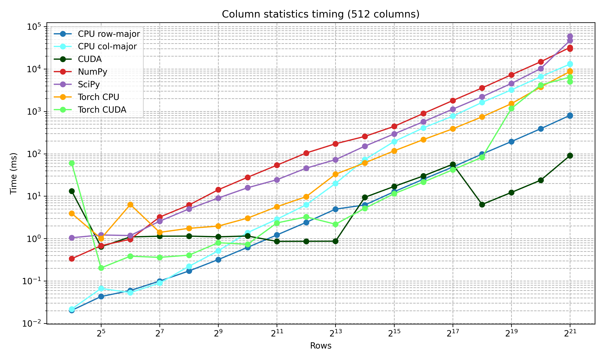
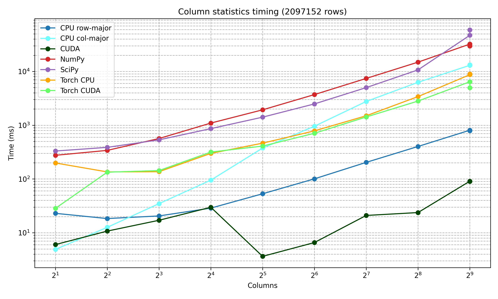

# Statistics

> A momentumok implementációja videókártyán [Pébay cikkje](https://people.xiph.org/~tterribe/pubs/P%C3%A9bayTerriberryKolla%2B16-_Numerically_Stable%2C_Scalable_Formulas_for_parallel_and_Online_Computation_of_Higher-Order_Multivariate_Central_Moments_with_Arbitrary_Weights.pdf) alapján készült. Ezek a [statistics.cu](https://github.com/EgyipTomi425/statistics/blob/master/statistics_cuda.cu) fájlban találhatóak.

## Momentumok

Welford adott online algoritmust a momentumok (és abból származtatott mennyiségek) frissítésére és összefésülésére. Ezt később Pébay általánosította, majd egy korrekciós tagot bevezetve a binomiális tétel alapján egy numerikusan stabilabb two-pass algoritmust írt le.

$$
\mu_p = \sum_{k=0}^{p} \binom{p}{k}
\left( \sum_{i=1}^{n} (x_i - \bar{x})^{p-k} \right)
\left( -\frac{1}{n} \sum_{i=1}^{n} (x_i - \bar{x}) \right)^k
$$

A második, korrekciós tag a numerikus hibák kioltása miatt jött be, mert ha nem a pontos átlagunk van, akkor annak hatványai erősen növelik a hibát. Ha az átlag nem lenne numerikus kerekítések által hibával terhelt, akkor 0 lenne, és a klasszikus képlethez jutunk vissza. Mivel a momentum rendje alacsony, ezért kifejthető a binomiális tétellel az alábbi módon:

$$
\mu_4
= S_4 - 4 \, \delta \, S_3 + 6 \, \delta^2 \, S_2 - 3 \, N \, \delta^4
$$

Átírva és behelyettesítve a negyedik centrált momentum például:

$$
\mu_4 = \sum_{i=1}^{N} (x_i - \bar{x})^4 - 4 \sum_{i=1}^{N} (x_i - \bar{x})^3 \left( \frac{1}{N} \sum_{j=1}^{N} (x_j - \bar{x}) \right) + 6 \sum_{i=1}^{N} (x_i - \bar{x})^2 \left( \frac{1}{N} \sum_{j=1}^{N} (x_j - \bar{x}) \right)^2 - 3 N \left( \frac{1}{N} \sum_{i=1}^{N} (x_i - \bar{x}) \right)^4
$$

A two-pass algoritmus lényege, hogy először végigeterál az adathalmazon az átlagért, aztán kiszámolja $(x_i - \bar{x})^n$ minden elemre, ezeket külön összeadja, és a végén behelyettesít a képletbe. Ez numerikusan sokkal stabilabb eredményt ad. A lebegőpontos számok lépésköze egyre nagyobb, ahogy egyre nagyobb számokat adunk össze, így hasonló nagyságrendű számokat érdemes összeadni, csökkentve a hibát. Ezt csinálja a pairwise corrected two-pass algoritmus, ami bináris fába rendezi az adatot, és folyamat mergeli a közel azonos méretű halmazokat. Ez kicsit pontosabb, de sokkal több memóriát fogyaszt, jelentősen növelve a futási időt. A hibát úgy csökkentettem, hogy ne kelljen újra globális memóriába írni, hogy több szálat rendeltem egyenletes eloszlással egy oszlophoz. Ezeket előbb szálon belül, majd blokkon belül, majd blokkok között egyesítettem, hogy hasonló nagyságrendű számokat adjon össze, középutat adva a két módszer között.

### Használt hardver

Egy 12700H processzor volt tesztelésre használva 32 GB 4800 MHz memóriával, az alábbi videókártyával és kernelbeállításokkal:

```yaml
Device 0: NVIDIA GeForce RTX 3050 Laptop GPU
  Total Global Memory: 4294443008 bytes
  Shared Memory per Block: 49152 bytes
  Registers per Block: 65536
  Warp Size: 32
  Memory Pitch: 2147483647
  Max Threads per Block: 1024
  Max Threads Dim: [1024, 1024, 64]
  Max Grid Size: [2147483647, 65535, 65535]
  Total Constant Memory: 65536 bytes
  Compute Capability: 8.6
  Texture Alignment: 512
  MultiProcessor Count: 16
  Integrated: 0
  Can Map Host Memory: 1
  Concurrent Kernels: 1
  ECC Enabled: 0
  PCI Bus ID: 1, PCI Device ID: 0
  TCC Driver: 0
  Async Engine Count: 5
  Unified Addressing: 1
  Memory Bus Width: 128 bits
  L2 Cache Size: 1572864 bytes
  Max Threads per Multiprocessor: 1536
  Shared Memory per Multiprocessor: 102400 bytes
  Managed Memory: 1
  Concurrent Managed Access: 0
  Pageable Memory Access: 0
  
  LaunchConfig:
    threads_per_block:   512
    max_blocks:          48
    shared_per_block:   34133 bytes
    shared_per_thread:   66 bytes
    regs_per_thread:     128
----------------------------------------
```

Egy kernelnek a warp, azaz 32 szál a legkisebb végrehajtási egysége. Minden szálnak külön vannak regiszterei. A warpokból épül fel a blokk, ami a shared memóriát tudja használni a szálak között, ami nagyon gyors. Blokkon belül lehet szinkronizáció, blokkok között nem. A blokkokat a streaming multiprocesszorok futtatják párhuzamosan. Ez a gyengének számító GPU is 48x512 szállal rendelkezik összesen. Nem feltétlen futnak egyszerre, és az órajelük is alacsonyabb. A sebességnövekedés a memória kihasználásával érhető el elsődlegesen. [A Pytorch is CUDA-t használ, bár ő Welford](https://github.com/pytorch/pytorch/blob/main/aten/src/ATen/native/cuda/Reduce.cuh) módszerrel számolja.

## Az implementáció

Követve a two-pass algoritmust, szükség van először az átlagra, mert az összes többi centrált momentum és annak hibája ettől függ. Matematikailag asszociatív ezeknek a gyűjtése. A második iteráció végén behelyettesítés után kiszámoljuk a ferdeséget és a csúcsosságot is.

Egy szál tudja használni a saját regisztereit, a shared memóriát és a globális memóriát. A különbség az ezekhez szükséges ciklusok száma, így minimalizálni kell a globális memória olvasását. A globális memória a memory bus méretétől függően össze tud vonni tranzakciókat, ha azok folytonosan vannak lekérve a különböző szálaktól.

Az asszociativitás miatt minden szálhoz fog tartozni egy oszlop. Mivel egy statisztikai probléma rendszerint maximum néhány száz attribútumból áll, a GPU szálai pedig több tízezer, ezért a feature-ök számával osztható stride kell, így adott szál csak egy oszlop adatait kell gyűjtse regiszter szinten. A stride-on belül így minden szál egymás melletti indexet kér a globális memóriából, warp szinten is folytonos, ezért hatékonyan vannak kihasználva a tranzakciók. Egy szál tetszőleges számú iterációt kaphat és dolgozhatnak más szálak az oszlop más elemein.

Miután minden szál végzett a blokkon belül, kiírja az eredményeit a shared memoryba. Ezután a blokkon belül annyi szál, ahány oszlopra jutott munka (legfeljebb a blokk dimenziója) külön redukálják az azonos oszlopon dolgozó szálak eredményeit. Így javul a numerikus stabilitás is. Az eredményeket beleírja egy globálisan létrehozott cache-be, mert nincs blokkok közötti szinkronizáció, de ezek csak a végeredmények. Ezután egy új, redukciós kernelben redukáljuk a blokkok eredményeit, kiszámoljuk a tagokat, és behelyettesítünk a végső képletbe. Összesen 4 kernelre van szükség: az első passban az átlagra, másodikban pedig a többi momentumra.


Az oszlopok számának nem kell kettő hatványának lenni, de ha legalább 32 darab van, a warp szintű hardveres feldolgozás miatt jobb eredmény érhető el. Az oszlopok száma nem haladhatja meg a blokk dimenziót.

## Eredmények

A módszer sebessége több könyvtárral is össze lett hasonlítva. Használva volt a Torch (CPU+GPU), Scipy, Numpy mellett validálásra használtunk még egy sor- és oszlopfolytonos CPU "klasszikus" módszert. A sebességteszteknél random mátrixok voltak generálva, oszlopok és sorok száma szerint csoportosítva. A CPU-GPU közötti másolási idő nincs beleszámolva a mérési időkbe, mert egy pipeline lehet teljesen GPU is.



Az ábrák mindkét tengelyen logaritmikus skálázással voltak ábrázolva, hogy együtt ábrázolhatóak legyenek különböző nagyságrendű adathalmazokon. Egy kis adathalmazon, aminek kevés sora van, elveszítjük a többszálúsítás előnyeit. Tekintve a CUDA megoldásokat, a futási idő sokáig konstans maradt ~10ms környékén az egyre több használt szál miatt. Ez a trend a Torch esetében is megfigyelhető, csak kisebb adathalmazra dinamikusan választja a kernelméretet, így optimalizáltabb volt a futási ideje. Amint szükség volt minden szálra, a futási idők nagyot nőttek mindkét esetben, de már nem volt szignifikáns különbség köztük. Nagyon nagy adathalmazokon a Torch bizonyult lassabbnak, valószínűsíthetően, mert a template paraméterei szokványos esetekre vannak jól optimalizálva. A CPU esetben nagyon jól látszik, hogy a memóriatranzakciók összevonhatók, ezért ha sorfolytonosan iterál a processzor, akkor jóval kevesebb tranzakcióra van szüksége, ha az oszlopok száma nagyobb.



Ha nagyon sok sora volt az adathalmaznak, és az oszlopok száma volt növelve, megfigyelhető itt is egy lineáris trend. A mátrix sorfolytonosan volt tárolva, és a 32 oszlopnál megfigyelhető egy szignifikáns gyorsulás. Mivel a GPU a kódot warpokban hajtja végre, ami pont 32 szálból áll, így a warpban mindenki más szálat kap (akkor is, ha több, mint 32 szál van), így kevesebb lesz az ütközés, és a redukció is jobban működik. Egy méret felett viszont minden beáll lineárisra, mert ott már csak a memória sebessége szab határt, nem a szálak teljesítménye.

## Konklúzió

Kiderült, hogy a videókártyán való számításhoz nagyon fontos, hogy a változókat milyen memóriaterületre írjuk. Ha az adathalmaz elég nagy, akkor a futási időknek a VRAM sebessége szab egy lineáris határt, kisebb adathalmazon pedig a kernel paraméterek optimalizálása, ha a feladat tipikusan kevés szinkronizációt igényel a globális memóriával.

Implementálásra kerültek a ferdeséget és csúcsosságot videókártya segítségével. A Torch egy machine learning könyvtár, aminek nincs szüksége a szórásnál magasabb rendű momentumokra neurális hálókhoz, de elemzéshez hasznos lehet.
