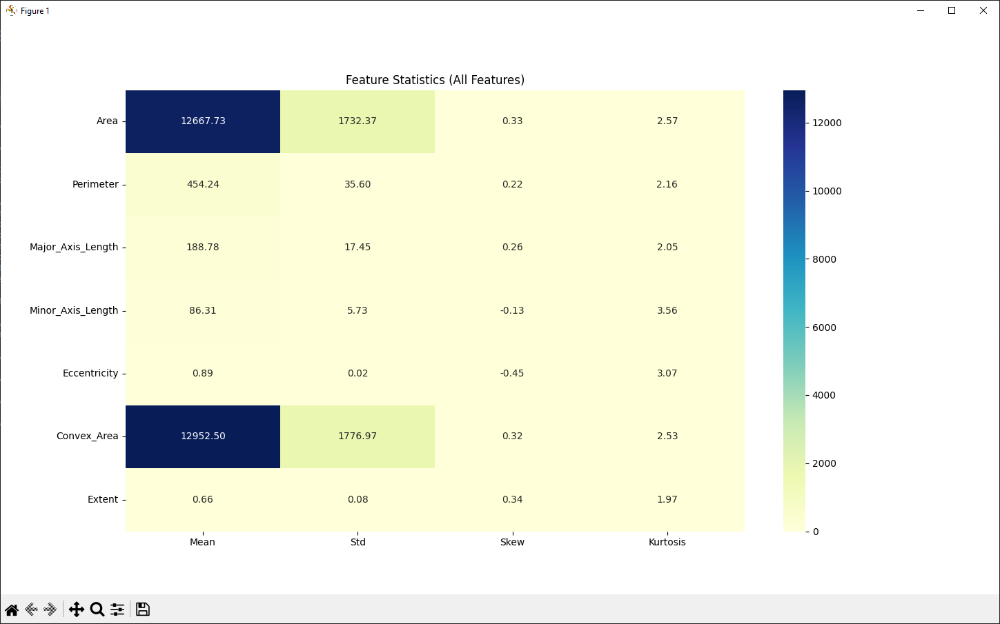
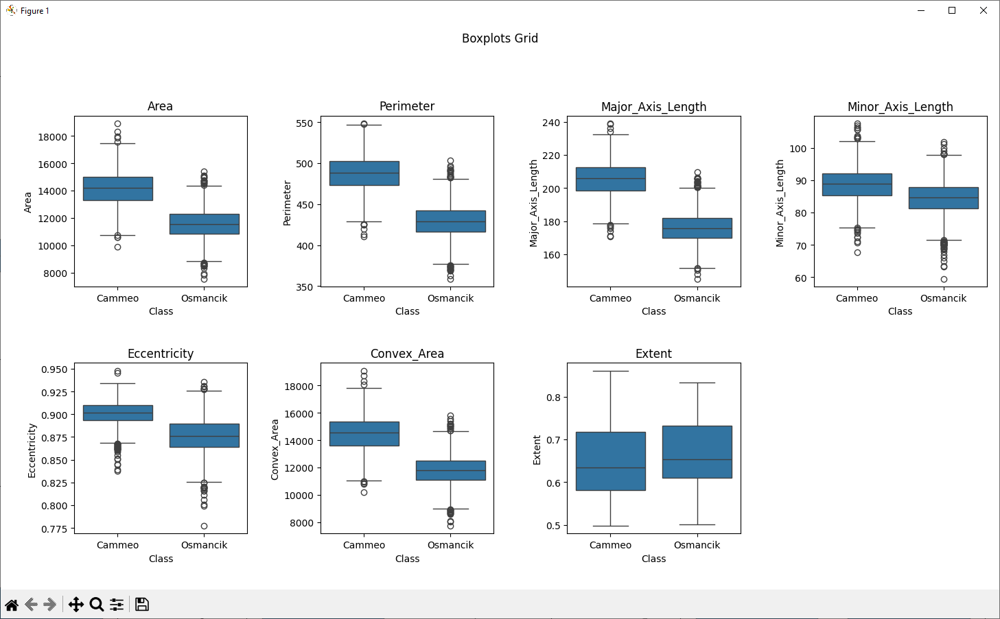
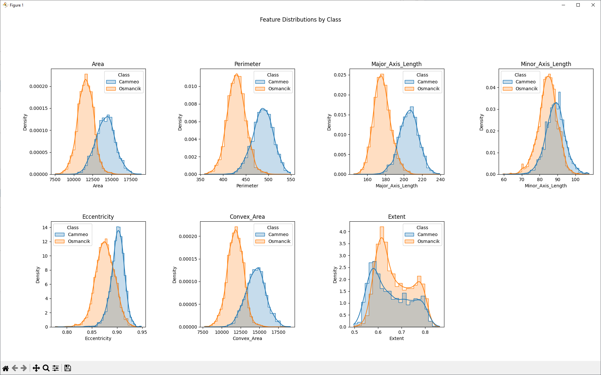
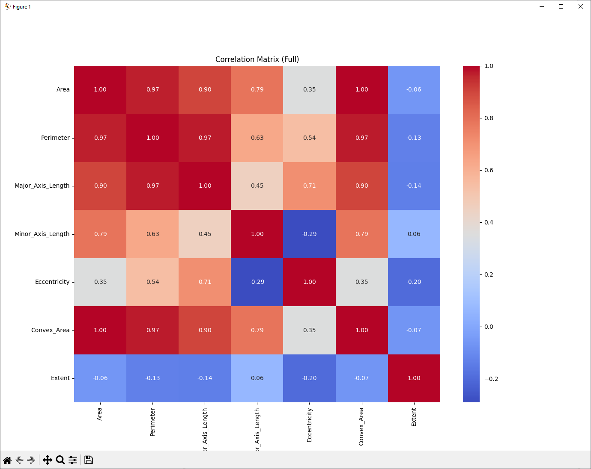
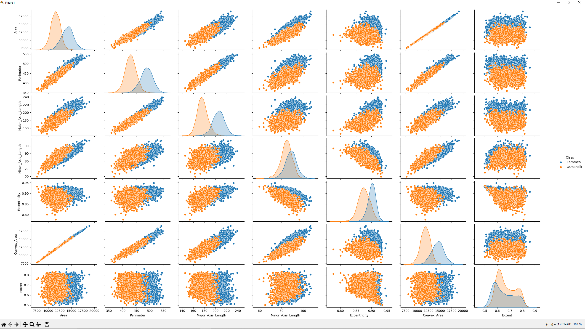
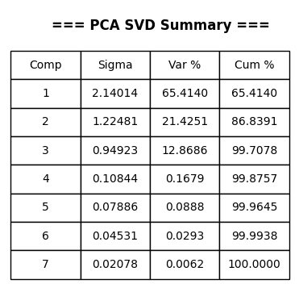
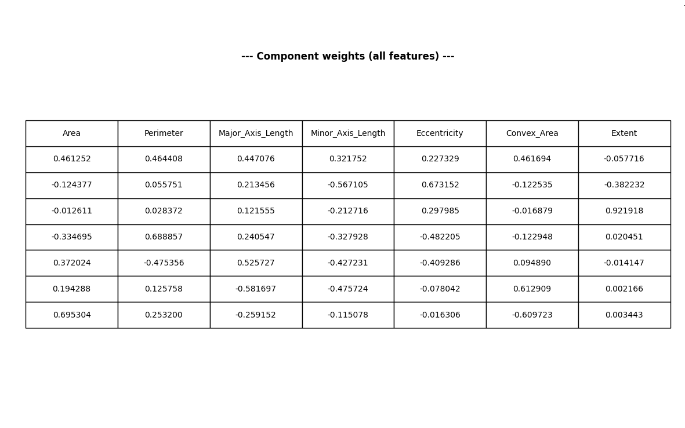
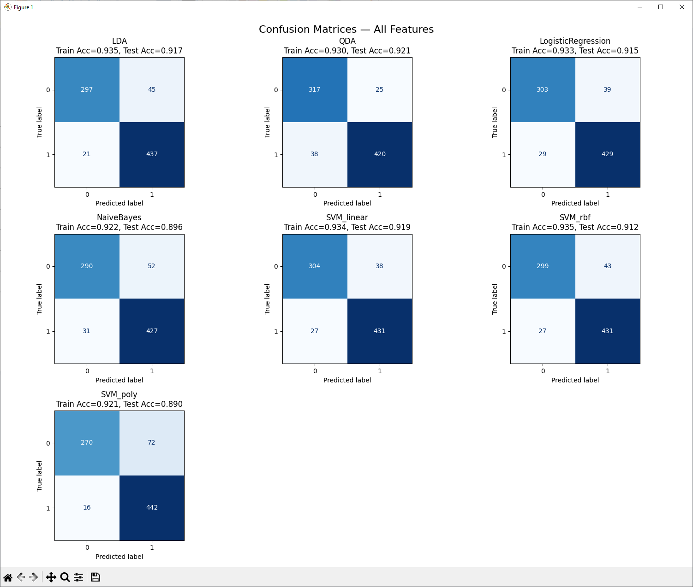
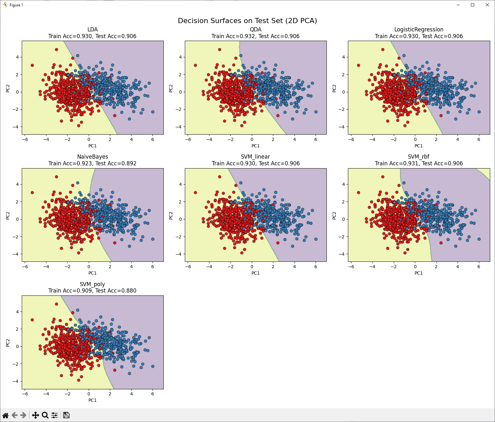

# [Rice](https://archive.ics.uci.edu/dataset/545/rice+cammeo+and+osmancik) adathalmaz

> A momentumok implementációja videókártyán [Pébay cikkje](https://people.xiph.org/~tterribe/pubs/P%C3%A9bayTerriberryKolla%2B16-_Numerically_Stable%2C_Scalable_Formulas_for_parallel_and_Online_Computation_of_Higher-Order_Multivariate_Central_Moments_with_Arbitrary_Weights.pdf) alapján készült. Ezek a [statistics.cu](https://github.com/EgyipTomi425/statistics/blob/master/statistics_cuda.cu) fájlban találhatóak.

## Momentumok

Welford adott online algoritmust a momentumok (és abból származtatott mennyiségek) frissítésére és összefésülésére. Ezt később Pébay általánosította és adott two-pass algoritmust és formulát ennek megállapítására.

$$
\mu_p = \sum_{k=0}^{p} \binom{p}{k}
\left( \sum_{i=1}^{n} (x_i - \bar{x})^{p-k} \right)
\left( -\frac{1}{n} \sum_{i=1}^{n} (x_i - \bar{x}) \right)^k
$$

A második, korrekciós tag a numerikus hibák kioltása miatt jött be, mert ha nem a pontos átlagunk van, akkor annak hatványai erősen növelik a hibát. Mivel a momentum rendje alacsony, ezért kifejthető a binomiális tétellel az alábbi módon:

$$
\mu_4
= S_4 - 4 \, \delta \, S_3 + 6 \, \delta^2 \, S_2 - 3 \, N \, \delta^4
$$

Átírva és behelyettesítve a negyedik momentum például:

$$
\mu_4 = \sum_{i=1}^{N} (x_i - \bar{x})^4 - 4 \sum_{i=1}^{N} (x_i - \bar{x})^3 \left( \frac{1}{N} \sum_{j=1}^{N} (x_j - \bar{x}) \right) + 6 \sum_{i=1}^{N} (x_i - \bar{x})^2 \left( \frac{1}{N} \sum_{j=1}^{N} (x_j - \bar{x}) \right)^2 - 3 N \left( \frac{1}{N} \sum_{i=1}^{N} (x_i - \bar{x}) \right)^4
$$

A two-pass algoritmus lényege, hogy először végigeterál az adathalmazon az átlagért, aztán kiszámolja $(x_i - \bar{x})^n$ minden elemre, ezeket külön összeadja, és a végén behelyettesít a képletbe. Ez numerikusan sokkal stabilabb eredményt ad. A lebegőpontos számok lépésköze egyre nagyobb, ahogy egyre nagyobb számokat adunk össze, így először a kisebb számokat érdemes összeadni, csökkentve a hibát. Ezt csinálja a pairwise corrected two-pass algoritmus, ami bináris fába rendezi az adatot, és folyamat mergeli a közel azonos méretű halmazokat. Ez nagyon jól többszálúsítható, de sok memóriát fogyaszt. A hibát úgy csökkentettem, hogy ne kelljen újra globális memóriába írni, hogy több szálat rendeltem egyenletes eloszlással egy oszlophoz. Ezeket előbb szálon belül, majd blokkon belül, majd blokkok között egyesítettem, hogy hasonló nagyságrendű számokat adjon össze. Az indexelés a memóriaolvasások miatt van. Ez stabil maradt a negyedik momentumig, és a csúcsosságot is jól ki tudta számolni.

Az eredmények a [Output_cpp.txt](https://github.com/EgyipTomi425/statistics/blob/master/projects/1_stat/Output_cpp.txt) fájlban találhatóak.

CPU-val ellenőriztem és [Pythonban](https://github.com/EgyipTomi425/statistics/blob/master/projects/1_stat/python_files/main.py) meghívtam a beépített függvényt, és ugyanazokat az eredményeket kaptam:

Az adatok nagyságrendjei eltérnek, ezért skálázásra lesz szükség. Az ferdeség itt most nem relatív a normális eloszláshoz. Az adatokat ábrázoltam osztályok szerint boxploton és grafikonon is.

Az adatok jól láthatóan normális eloszlásból származnak, jól szétválaszthatóak, és az Osmancik csúcsossága jóval nagyobb. Az adatok között sok a kiugró érték.

A korrelációs mátriix rendkívül erős korrelációt mutat az attribútumok között, nagyon sok a 0.9 feletti is. Ez annyira magas, hogy talán egyes attribútumokat ki is lehetne hagyni vagy jól dimenziócsökkenteni PCA segítségével.

Jól láthatóan már két komponens is elég jól leírja az adatot, de 3 már 99.7%-át magyarázza a teljes adathalmaznak. Ez már annyit jelent, hogy a maradék 4 komponens már csak "zaj". Veszteség nélkül tudunk 3 dimenzióban maradni, ahogy a lenti Scree Ploton is látszik. 

Ezeket a komponenseket Pythonból kaptam. A CUDA változatban ugyanezeket kaptam, csak minden értéket negálva (sajátvektor megoldásból jön).
Ez a táblázat, főleg az első komponensben erősen ráerősít a 0.9 feletti korrelációkra, 4 attribútomot is közel ugyanolyan súllyal vett, amit gyakorlatilag eggyel is helyettesíthetnénk. Ezek tipikusan a méretét határozzák meg a rizsszemeknek, és ez magyaráz a legtöbbet is a főkomponensekből. A sűrűséggrafikonokon láthattuk, hogy két osztály ezekben a paraméterekben közel ugyanaz volt, eltolással.

A második főkomponens már nem azonos súlyokkal, de tipikusan az alakra és a tömörségre megy rá és kap súlyokat. Ha már ezt a két információt tudjuk, akkor már majdnem biztosan be tudjuk azonosítani.

A harmadik, már kevésné lényeges főkomponens a nyújtságra megy rá, és ezzel megmagyaráztuk az adat 99.7%-át, így a többivel már nem is érdemes foglalkozni.

A sejtésünk alapján az adat jól szeparálható volt. Az összes klasszikus algoritmussal 90% körüli pontosságot tudtunk elérni, tehát a probléma lineárisan szeparálható, és felesleges machine learninget alkalmazni.

Viszont, mivel az adatot teljesen magyarázza 3 komponens, ezért ezekkel is kis eltérésekkel ugyanazokat az eredményeket kaptuk.

Mivel az adat jó részét magyarázza már csak két komponens is, és 2D-ben jól lehet rajzolni, ezért elvégeztem a feladatot 2D-ben is. Itt is 90% körüli pontosságok voltak a teszt adathalmazon (az látható a képen), és egy egyenessel is el sikerült érni sokkal bonyolultabb kernelek teljesítményét, tehát a feladat még 2D-ben is lineárisan szeparálható maradt.